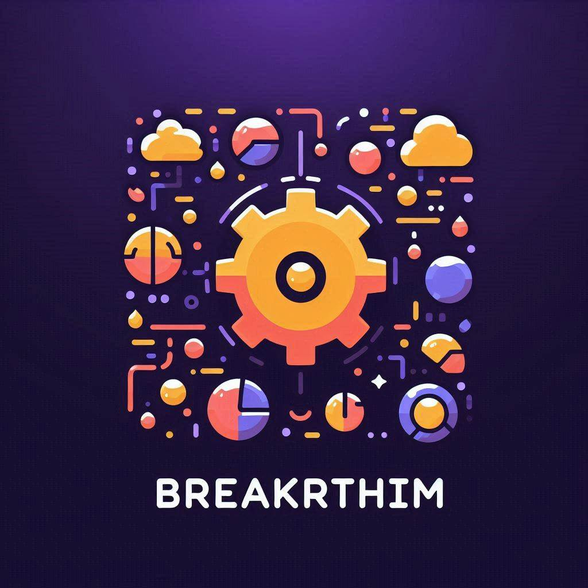

# ⛓️‍💥Breakrithm


```
🔥알고리즘을 부신다!
```
- [노션 링크](https://www.notion.so/jjongs/dfa9b0ff42594542a07114305bd9f792?pvs=4)
- [알고리즘 문제 링크](https://www.notion.so/jjongs/3490a2666442434e9a861a4607d853eb?v=51d905658c1645ba8f5861a37bcb2157&pvs=4)

# 패키지 구조
1. week 패키지 아래에 자기 `github name`으로 패키지 생성
2. 해당 파일 내부에 주차별 푼 문제 기록 및 WIL 작성

```
 [week_1]
  └ [github name] 
    └ [Problem].java
    └ WIL.md
  └ [github name]
    └ [Problem].java
    └ WIL.md
  └ ...
 [week_2]
    ...
 [week_3]
    ...
```

# Study plan 
- 매 주 수요일 21시 정기 모임 (상황에 따라 변경될 수 있음)
- 월 1만원 회비 (알고리즘 문제 결제 비용)
- 참석 못할 경우 5천원 벌금

